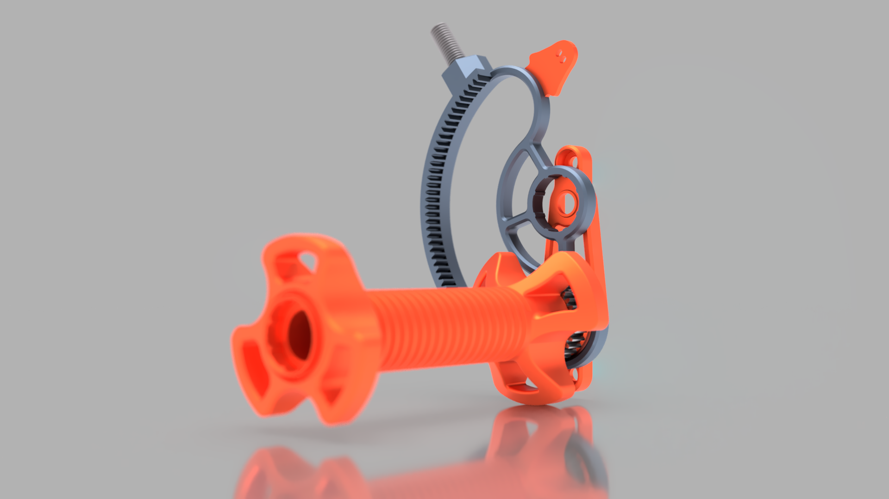

# SpooBu - A **Spoo**l **Bu**ffer aka Spool Rewinder

What if... we don't need a buffer but... rewind the filament back onto the spool...? This is SpooBu! A gravity-based filament spool rewinder. Imagine you're standing next to your printer and manually spinning the spool back when your MMU changes/unloads the filament. Since that would be very time-consuming, I invented SpooBu!

## How does it work?

It's a very simple mechanism: It's a spool holder with a counterweight that loads up as the spool spins, and then the counterweight spools the spool back up when the filament gets unloaded.

SpooBu is made out of three parts: a spool mount, a little gear on the spool mount, and a counterweight. When the printer feeds the filament, the spool starts to spin, and as the little gear is attached to the spool mount, it also spins. The little gear has contact with the counterweight, so when the spool spins, the little gear spins as well, which then spins the counterweight to move it upwards.
When the printer unloads the filament, the tension on the spool gets released, and the counterweight can move down again (thanks, gravity!). As it does that, it spins the little gear on the spool mount and therefore also the spool. Tadaa, your filament got rewound on the spool.

I did record a quick demonstration video of SpooBu (this is just a testing setup and very messy): https://youtu.be/ba3n2fLI1wE

## What to print?

Print all the files from the `_Common` folder. If your measured filament length is already in the `STL` folder you're good for printing! If not you can super easily adapt the CAD for your filament length, even though if you never worked with CAD before! It's super simple and I showed every single step in the video linked further down. And before your world is falling apart, give me a ping on my or the Voron Discord and I will try my best to give you a set of files. Please make a Pull Reuest if you adapted the CAD for your length.

A little note about the filament length: I would substract ~20mm from the measured length so you dont risk to pull out the filament of the MMU (this never happened to me with my stock ERCF). To measure the length, just load the filament into the nozzle, add a little mark on the filament at the mmu, unload the filament and measure the length (a little bit like you tune e-steps).

The design is based on the [Universial Filament Spool Mount from PurchenZuPoden](https://www.printables.com/de/model/65651-universal-filament-spool-holder). Just download and print the mount from there (the nut and one of the mounts - the short mount works for regular sizes spools)

The `_Optional folder` contains some optional parts, you can use if you want. You can print some of the M8 screws, I use a printed M8x16mm screw for the counterweight axis which works very well. You can also print the nut-weight screw, but then you loose the weight of the screw. The ECAS holder is to properly route your PTFE Tubes - make sure that you have a proper PTFE routing! Everything should be nice and smooth and secure.

## How can I use it for my printer?

Simple answer: Parametric CAD design! Not much to say here, just measure the length of filament you have to buffer, paste that in the CAD file, print the files, and that's it :D. I made a little instruction video on how you can create your own set of files. Feel free to make a Pull Request with your files so others can use your files in case they have the same buffer length!

You need the [Helical Gear + Plugin](https://apps.autodesk.com/FUSION/de/Detail/Index?id=1259509007239787473&appLang=en&os=Mac) to adapt the CAD file!

I did record a short CAD tutorial how to adapt the Design: https://youtu.be/17P4wHjeBd8

## Credits

Thanks to Pavel Hartmann for [his rewinder](https://youtu.be/otfgxMiwivw?si=FOWaNhXBAOYx1tBN) idea!

Thanks to all the people on my Discord for tinkering with me!

Thanks to [PurchenZuPoden](https://www.printables.com/de/model/65651-universal-filament-spool-holder) for the spool mount!
